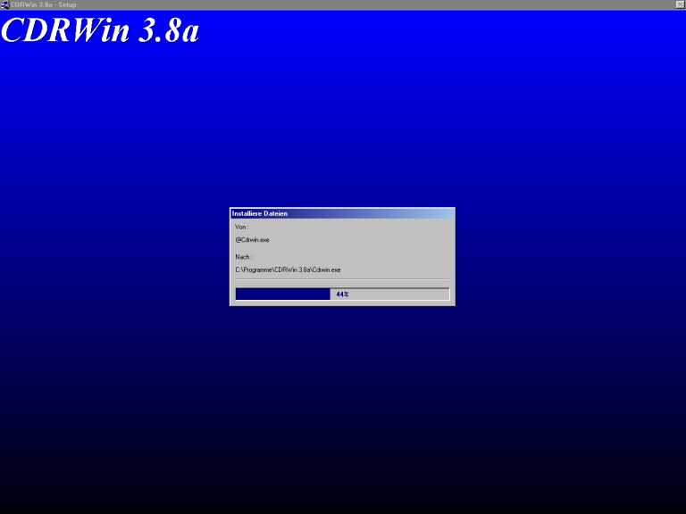



## Installation Program

### Description

Installation Program which uses cabfile-compression, creates shortcuts and folders and looks quite good - just like InstallShield ! If you ever wanted to code something like InstallShield (only a liitle bit less complex), you can start with this code. Included in the ZIP File are 3 more ZIP-Files which contain the actual code and a TXT File which gives you some reports.
 
### More Info
 

             |
---                |---
**Submitted On**   |2000-11-15 23:47:38
**By**             |[Thomas Sturm](https://github.com/Planet-Source-Code/PSCIndex/blob/master/ByAuthor/thomas-sturm.md)
**Level**          |Advanced
**User Rating**    |4.4 (22 globes from 5 users)
**Compatibility**  |VB 6\.0
**Category**       |[Complete Applications](https://github.com/Planet-Source-Code/PSCIndex/blob/master/ByCategory/complete-applications__1-27.md)
**World**          |[Visual Basic](https://github.com/Planet-Source-Code/PSCIndex/blob/master/ByWorld/visual-basic.md)
**Archive File**   |[CODE\_UPLOAD1171611152000\.zip](https://github.com/Planet-Source-Code/thomas-sturm-installation-program__1-12819/archive/master.zip)

